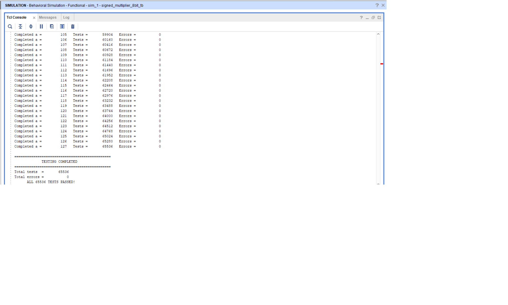

# 8-bit Signed Carry-Save Array Multiplier

## Overview

This project implements an **8-bit signed Carry-Save Array Multiplier** using Verilog HDL.

The multiplier accepts two **8-bit signed 2's-complement operands** and produces a **16-bit signed product**.

The design is implemented structurally using **Half Adders** and **Full Adders** arranged as a Carry-Save Array.

## Features

- 8-bit signed multiplication
- 2's-complement representation
- Carry-Save Array architecture
- Structural Verilog implementation
- Half Adder and Full Adder based design
- Signed partial-product correction
- 16-bit product output
- Exhaustive verification of all 65,536 input combinations

## Project Structure

- `rtl/half_adder.v` — Half Adder
- `rtl/full_adder.v` — Full Adder
- `rtl/signed_multiplier_8bit.v` — 8-bit signed CSA multiplier
- `testbench/tb_signed_multiplier_8bit.v` — Exhaustive verification testbench
- `results/exhaustive_test_result.png` — Verification result

## Verification

The design was exhaustively tested for every possible combination of the two 8-bit signed input operands.

Each input has 256 possible values, giving a total of **65,536 combinations**.

The hardware output was compared against the expected signed multiplication result for every combination.

### Result

- **Total tests:** 65,536
- **Total errors:** 0
- **Status:** **ALL 65,536 TESTS PASSED**

## Reference

The signed multiplication technique used in this project was studied from the following lecture:

**AM-12 - Carry Save Multiplier - Signed Multiplication**

**Prof. Janakiraman Viraraghavan**  
Department of Electrical Engineering  
Indian Institute of Technology Madras

### Reference Links

- [Lecture Video](https://www.youtube.com/watch?v=EA9ctQvcp_M)
- [NPTEL Digital IC Design Course](https://www.nptel.ac.in/courses/108106158)
- [IIT Madras Lecture Notes](https://www.ee.iitm.ac.in/~janakiraman/courses/EE5311/lecture_notes/module-6/ee5311-module-6-adder-mult.pdf)

## Tools

- Verilog HDL
- Xilinx Vivado
- Behavioral Simulation

## Acknowledgement

I would like to acknowledge **Prof. Janakiraman Viraraghavan, IIT Madras**, for the detailed explanation of carry-save multipliers and signed multiplication that served as the conceptual reference for this implementation.
